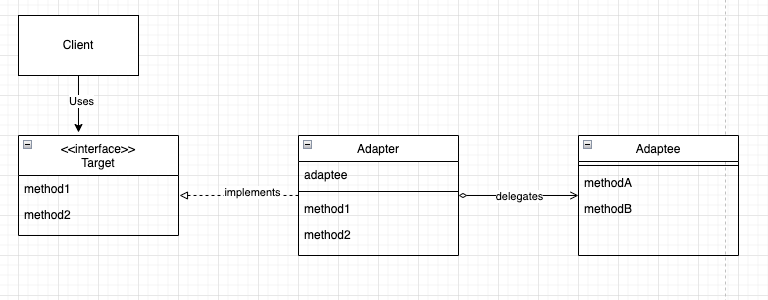

# Adapter 패턴

- 이미 제공된 것과 필요한 것 사이의 차이를 메우는 디자인 패턴
- Wrapper 패턴이라고 불리기도 함
- Adapter 패턴의 두 가지 종료
  - 클래스에 의한 Adapter 패턴(상속을 활용)
  - 인스턴스에 의한 Adapter 패턴(위임을 사용한 패턴)

### Adapter 패턴의 요소
- Target(대상)
  - 필요로 하는 대상 (할 것)
- Client(의뢰자)
- Adaptee(적응 대상자)
  - Adaptee는 이미 준비된 메소드를 가지는 역할
  - 준비된 것
- Adapter(적응자)
  - 어떻게든 타겟을 만족시키기 위해 Adaptee와 연결하게 하는 것
  - 상속 혹은 위임을 활용함임 (위임 주로 사용)
  - 