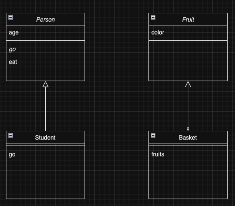
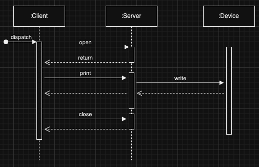

# UML
- Unified Modeling Language
- 시스템을 시각화하거나 사양 및 설계를 문서화하기 위한 표준

## 클래스 다이어그램
- UML 클래스 다이어그램은 클래스나 인스턴스, 인터페이스 등의 정적인 관계를 나타낸 것
- 상속
  - ▵ 실선
  - 표기 방법
      - 추상 클래스: 기울임꼴
      - static: 밑줄
      - 추상 메소드: 기울임꼴
- 구현
  - ▵ 파선
- 집약
  - 색, 과일, 바구니 클래스 관계
  - Basket 클래스의 fruits 필드는 fruit 배열로 되어 있다면?
    - '갖고 있는' -> 집약 관계

-  

## 시퀀스 다이어그램
- 시퀀스 다이어그램은 프로그램이 작동할 떄 어떤 메소드가 어떤 순서로 실행되는지
- 클래스 다이어그램은 시간에 따라 변하지 않는 것
- 시퀀스 다이어그램은 시간에 따라 변하는 것
- 표현
  - :Client, :Server 처럼 각 클래스 이름은 : 으로 표기
  - 각 인스턴스에서 아래 방향으로 뻗은 파선은 라이프 라인

- 